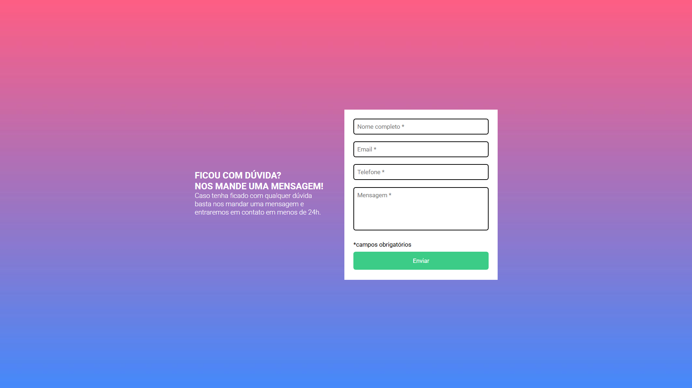

# Formulário 🖥

## Descrição
Formulário de contato com validação: apresenta um aviso informando que, em caso de dúvidas, o usuário pode enviar uma mensagem. Abaixo, há campos para preenchimento do nome, e-mail, telefone e a mensagem em si. O botão de envio só funciona quando todos os campos obrigatórios estão preenchidos corretamente; caso contrário, o envio não é realizado.

## Dificuldades
Como estou em processo de aprendizado da linguagem JavaScript, meu desafio neste projeto foi implementar a validação do formulário. Para isso, utilizei estruturas condicionais como if e else, garantindo que o envio só ocorra quando todos os campos estiverem devidamente preenchidos. Fiquei satisfeita com o resultado!

## Funcionalidades
- ✅ Layout responsivo: se adapta a diferentes tamanhos de tela, garantindo uma boa experiência em dispositivos móveis e desktops

- 🛠️ Desenvolvido com: HTML, CSS e JavaScript

- ✔️ Validação de formulário: o envio só é permitido após o preenchimento de todos os campos obrigatórios

## Projeto online
Acesse [aqui.](https://luciane003.github.io/formulario-responsivo-js/)

## Tecnologias

  
 &nbsp;&nbsp;
   
   &nbsp;&nbsp;
  

   

## Prévia do Projeto

### 📌 Formulário Inicial 

### ❌ Com Erros de Validação

### ✅ Validação com Sucesso

## Autora
- Luciane Kellen
- Feito como parte do meu processo de aprendizagem em programação!

  
  
  

